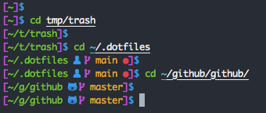

# lildude's dotfiles

**These are my old dotfiles. My new ones are now managed using chezmoi [here](https://github.com/lildude/dotfiles).**

## Instructions

```console
git clone git@github.com:lildude/dotfiles.git .dotfiles
.dotfiles/script/bootstrap
```

## My Prompt



## Slack Theme

Cos I need somewhere to store it

`#282A36`,`#44475A`,`#44475A`,`#8BE9FD`,`#6272A4`,`#FFFFFF`,`#50FA7B`,`#FF5555`,`#44475A`,`#FFFFFF`
